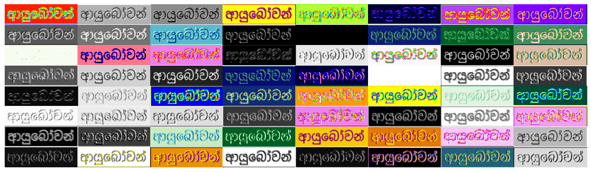

# Sinhala CRNN

## Motivation
After reading the CRNN paper [An End-to-End Trainable Neural Network for Image-based Sequence Recognition and Its Application to Scene Text Recognition](https://arxiv.org/pdf/1507.05717), I wanted to replicate this paper with my native language, Sinhala. The original research paper used [MJSynth dataset](https://www.google.com/url?sa=t&source=web&rct=j&opi=89978449&url=https://www.robots.ox.ac.uk/~vgg/data/text/&ved=2ahUKEwjym-TkvJmJAxWd4zgGHfD1ERoQFnoECBcQAQ&usg=AOvVaw23AQZ3gnxApzZLIQgUj4fk), which is a large and more natural-like dataset. Therefore, a model trained on MJSynth likely performs well on real-world scenarios.
**Quoting from research paper**:
*It generates an effective yet much smaller model, which is more practical for real-world ap- plication scenarios. The experiments on standard bench- marks, including the IIIT-5K, Street View Text and ICDAR datasets, demonstrate the superiority of the proposed algo- rithm over the prior arts.*

Example taken from MJSynth.

However, the model used to train Sinhala CRNN, [SOCR](https://huggingface.co/datasets/Ransaka/SSOCR-V.1)(Sinhala OCR, lol) Dataset is a bit straightforward.
Nevertheless, due to the complex structure of the Sinhala language, building such a comprehensive dataset is a bit tricky. Therefore I am leaving that for later. Therefore the model seems to learn these patterns pretty quickly. As you can see in the training loop, the model almost converged after 30 epochs with batch size 1024.

## Model
<figure>

<figcaption align='left'>Ref: https://arxiv.org/pdf/1507.05717</figcaption>
</figure>
Model adapted from original CRNN paper with below modifications (simplifications).
<figure>

<figcaption align='left'>Simplified CRNN</figcaption>
</figure>

### Training loop
<figure>

<figcaption align='center'>Training Process</figcaption>
</figure>
Total model consists of 4.8M parameters. Originally it was 8.3M parameters.